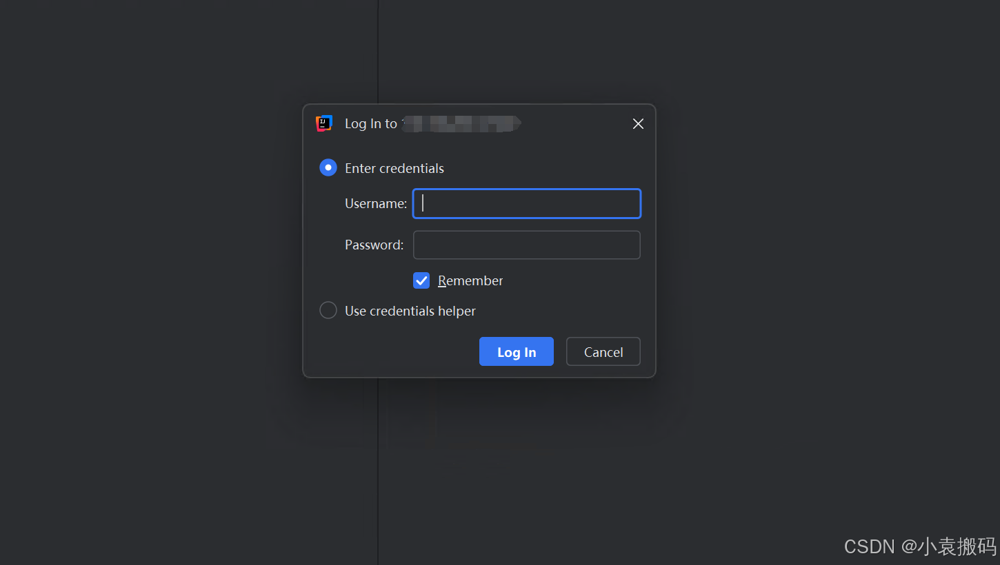
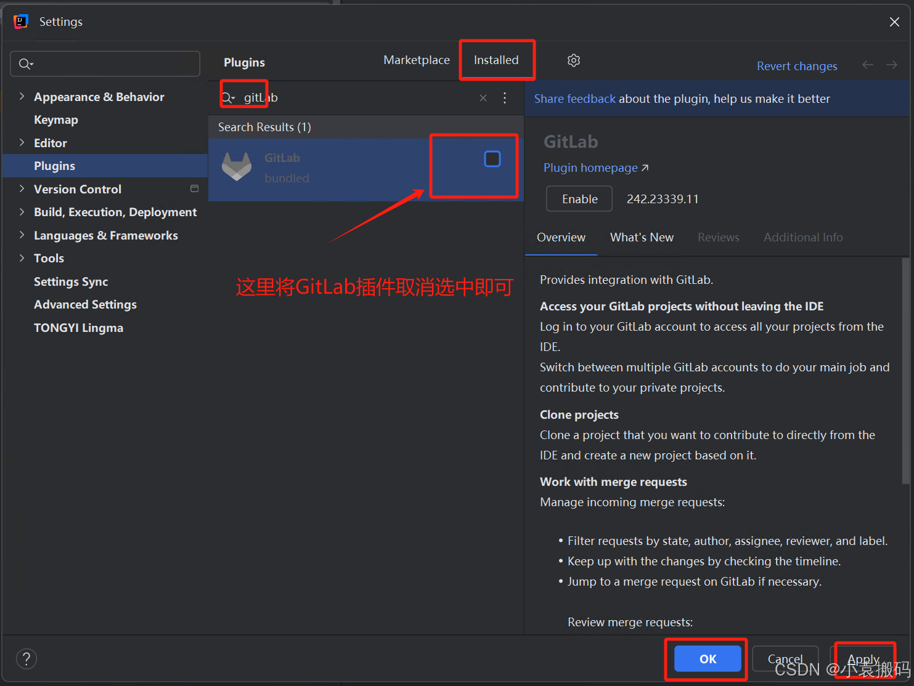
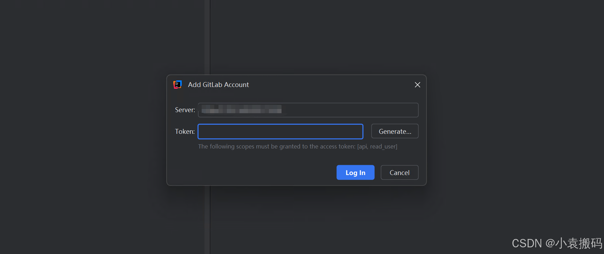

+++
title = 'idea拉取代码提示token问题'
date = 2024-11-26T20:19:54+08:00
menu = ['posts']
tags = ['idea']
+++

## 1. 问题描述
> 新装IntelliJ IDEA后，打开本地已有GitLab仓库代码时，提示输入token问题  

## 2. 问题处理
> 打开`Settings`-->`Plugins`禁用GitLab插件即可，如下图  

## 3. 禁用GitLab插件后输入用户名密码即可
> 禁用许可后，输入用户名密码后即可正常使用  
> 
